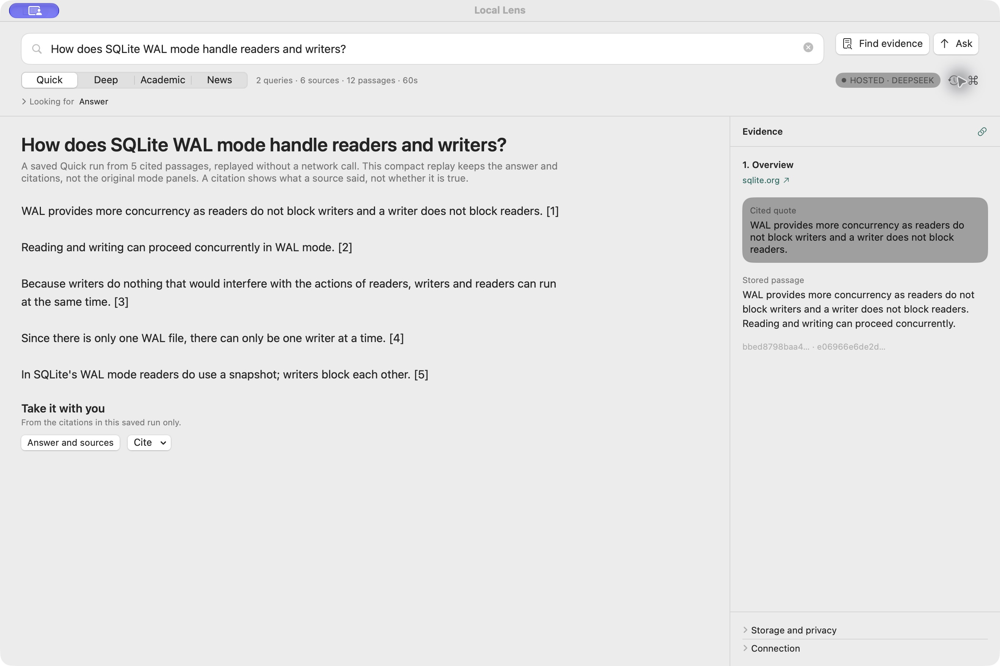
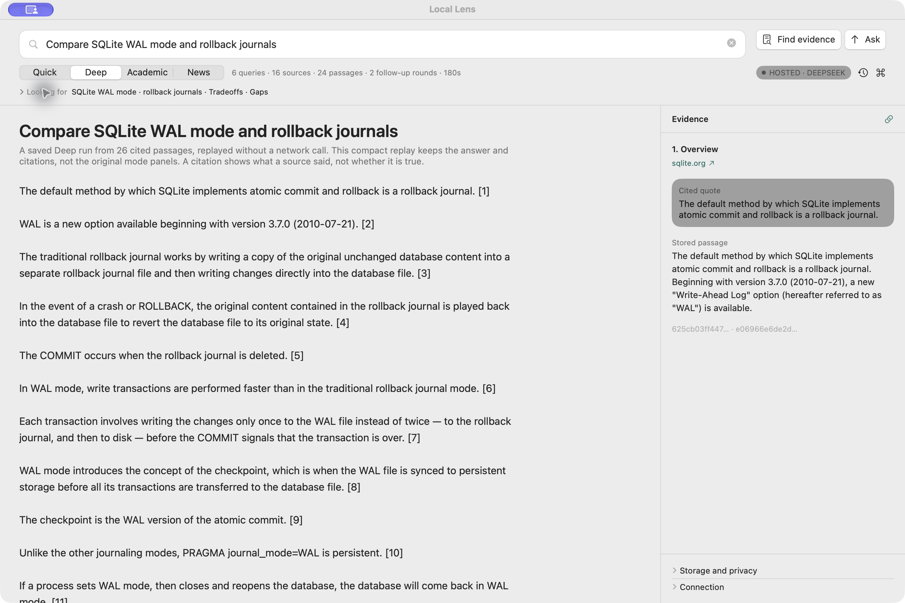
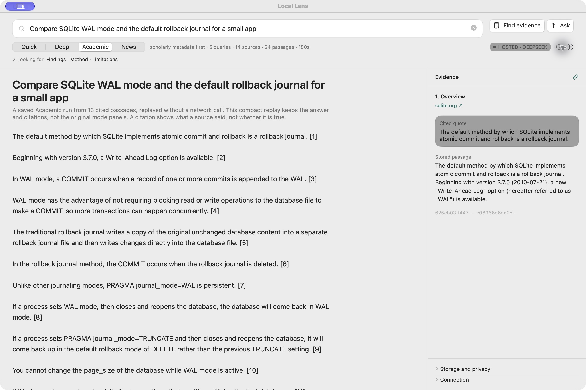
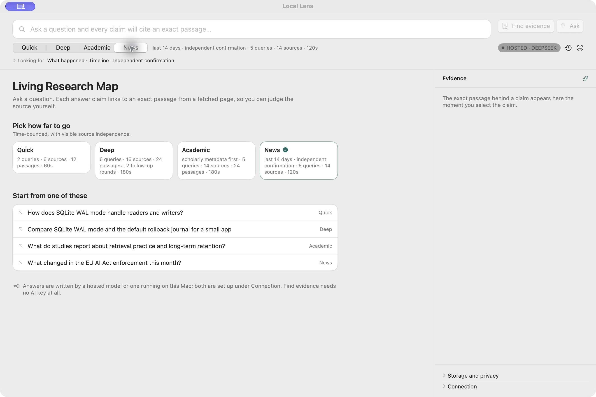

# Local Lens

**Research on your Mac, with the evidence beside the answer.**

Local Lens is a native macOS app for asking questions, exploring public sources,
and checking where an answer came from. It opens pages, saves the relevant
passages, and lets you select a claim to see the source text beside it. You can
also find evidence without asking an AI model to write an answer.

| Quick · a focused answer | Deep · a broader comparison |
| --- | --- |
| [](docs/social/2026-09-26/01-quick.jpg) | [](docs/social/2026-09-26/02-deep.jpg) |
| Academic · scholarly-first research | News · recent coverage and source independence |
| [](docs/social/2026-09-26/03-academic.jpg) | [](docs/social/2026-09-26/04-news.jpg) |

These are real app captures. Quick, Deep, and Academic show saved-run replays;
News shows the mode before a question is asked. Click an image to enlarge it.

## What you can do

- Choose **Quick**, **Deep**, **Academic**, or **News**. Each mode has its own
  research limits and approach, rather than just a different prompt.
- Follow a citation to the exact saved passage and the public page it came
  from. Inspect gaps and conflicting evidence instead of hiding them.
- Use **Find evidence** without an AI key, or generate an answer with DeepSeek
  or your own OpenAI-compatible local model endpoint.
- Reopen saved research on your Mac and export an answer with its sources.

A citation tells you what a fetched source said; it does **not** independently
fact-check that source. News and other time-sensitive claims still need care.

## Try it from source

Requires macOS 15 or later and Xcode with a Swift 6 toolchain.

```sh
git clone https://github.com/msulemans/local-lens.git
cd local-lens
make app
open "dist/Local Lens.app"
```

Paste a public page URL and choose **Find evidence** to try the passage
inspector without an API key. For general web search, add a Tavily key in
**Connection**. For generated answers, configure a separate DeepSeek key or a
local model endpoint. Hosted answering sends selected passages to the hosted
provider; saved runs and history stay on your Mac. Normal use does not require
Docker.

This is a public **development release**. The app has not been notarized or
reproduced on a second Mac. See the [release status](docs/HANDOFF.md) and
[contributor handoff](docs/AI_HANDOFF.md) for the remaining checks. The code is
[MIT licensed](LICENSE).
