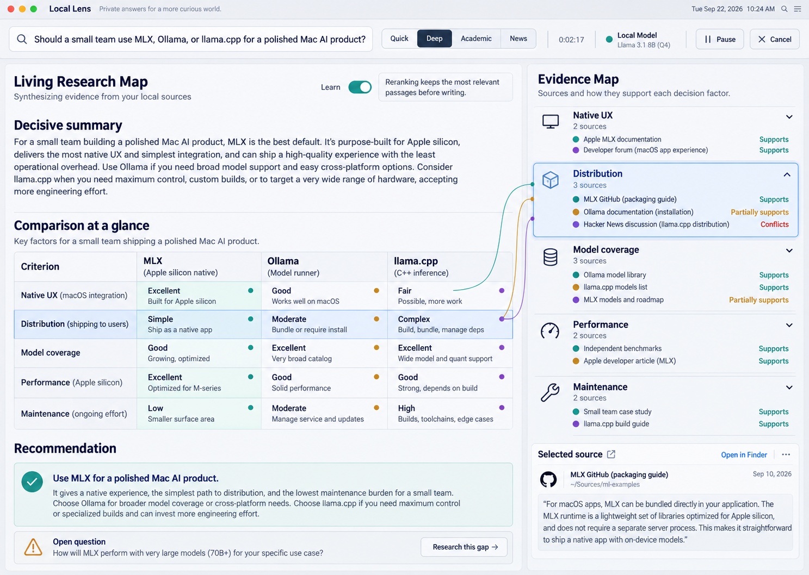

# Selected Visual Direction

Selected on 2026-09-22: **Living Research Map**.

## What is canonical

- a native macOS toolbar with question, mode, elapsed time, local/hosted state,
  pause, and cancel;
- an asymmetric living brief and evidence map;
- comparison tables as first-class answer blocks;
- evidence organized by the decision criteria in the question;
- sparse provenance ribbons connecting answer elements to evidence;
- explicit support, partial support, conflict, and open-question states;
- exact-passage inspection;
- a bounded `Research this gap` action; and
- a visible but subordinate learning explanation.

## What is illustrative

The screenshot's model names, recommendations, dates, benchmark values, source
quotes, and factual content are visual mock data. They are not research results
and must not be copied into product fixtures as facts.

## Responsive behavior

- Wide window: living brief and evidence map side by side.
- Medium window: evidence map becomes a resizable inspector.
- Compact window: evidence appears as a sheet and provenance ribbons become
  citation highlights.
- Quick launcher: separate compact surface; it is not represented in this
  selected image and will be designed when M003 begins.

## Accessibility requirements

- support keyboard navigation and full VoiceOver labels;
- never encode evidence relation by color alone;
- support increased contrast and reduced transparency;
- provenance ribbons need a text/list equivalent;
- minimum comfortable body size around 14-16 points; and
- preserve text selection and copying in answers and passages.

## Build rule

Implement the information hierarchy and interaction model before decorative
polish. Compare the coded screen and this reference at the same viewport before
claiming visual fidelity.
