# M009.4 — Mac UI close-out audit

Date: 2026-09-26 (Australia/Sydney). Scope: the built Mac app's normal research workspace, four modes via saved runs, evidence inspector, history, privacy and connection, launcher, invalid-plan refusal, and two historical windows then reachable from the Research menu. This audit used current-run computer-use captures; it did not spend a Tavily search credit or make a DeepSeek request. No history or Keychain item was deleted. The working tree remains uncommitted.

Verdict: the app has a usable evidence-first workspace, but the close-out pass found misleading trust/privacy copy, a stale answer under a new question, an unconfirmed destructive history action, and a custom-plan checkbox that silently fell back to defaults when empty. Those are fixed. Answer usefulness remains a separate, unclosed quality question: a live Deep comparison reads largely as source quotations, and a saved News run contains an extraordinary single-source allegation. An exact citation proves the text was fetched; it does not prove the text is true.

## Screens and outcomes

1. **Start / mode choice — healthy after repair.** A new launch gives Quick, Deep, Academic, and News with explicit budgets and examples. The empty evidence pane explains its purpose. The introductory copy now says the user can judge the fetched source, rather than implying fact checking. Accessibility: the icon-only toolbar controls have names in the accessibility tree; keyboard/VoiceOver navigation and color contrast were not measured. 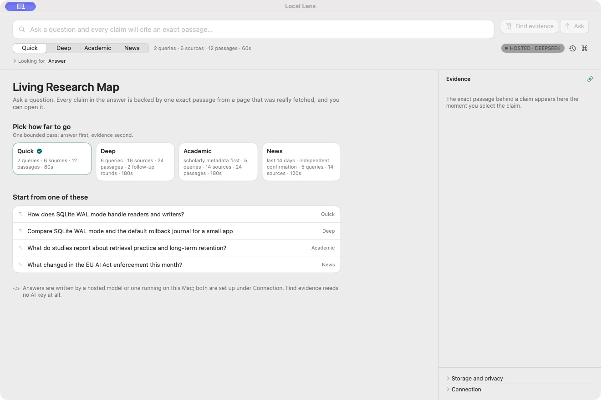

2. **Plan editing / refusal — healthy after repair.** Before, an enabled custom-plan checkbox could coexist with an empty editor while the default plan silently ran. Now empty custom dimensions show an inline reason and the run stops before Keychain or search work. The observed app refusal displayed the typed reason; a final copy pass changes its heading from the misleading “No supported answer” to “Research stopped.” [Expanded plan](m0094-ui-closeout-audit/05-plan.jpg). 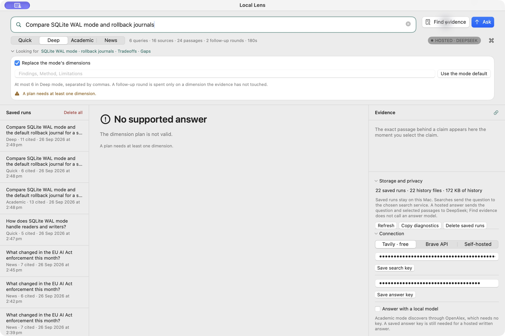

3. **Live Quick/Deep answer — partial.** The live Deep comparison shows an exact-citation rail, source link, passage inspector, measured comparison counts, and a stop reason. Its prose is still a long sequence of largely copied claims rather than a helpful synthesis, and two cited sources are third-party posts despite an official SQLite page being available. The UI now adds paragraph spacing without changing the stored answer or export, and states that citation linkage is not independent factual verification. This visual treatment does not raise the answer-quality score. 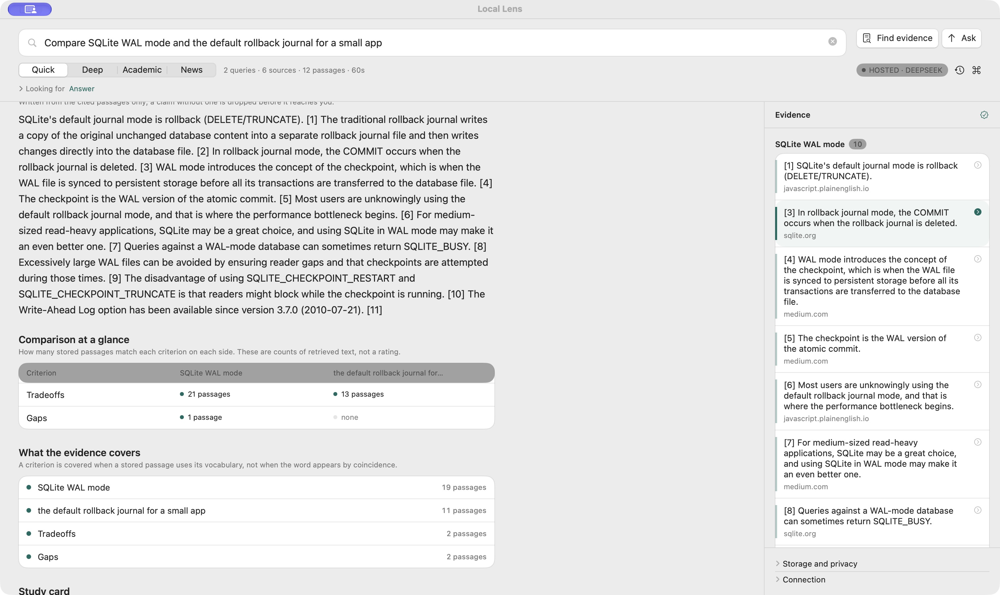

4. **Academic saved run — partial.** The saved run opens offline with exact citations and an inspector, but history stores a compact artifact, not the live paper matrix or limitations panel. The replay now says explicitly that mode-specific panels are not preserved. The separate live Academic screen was not re-run in this audit. 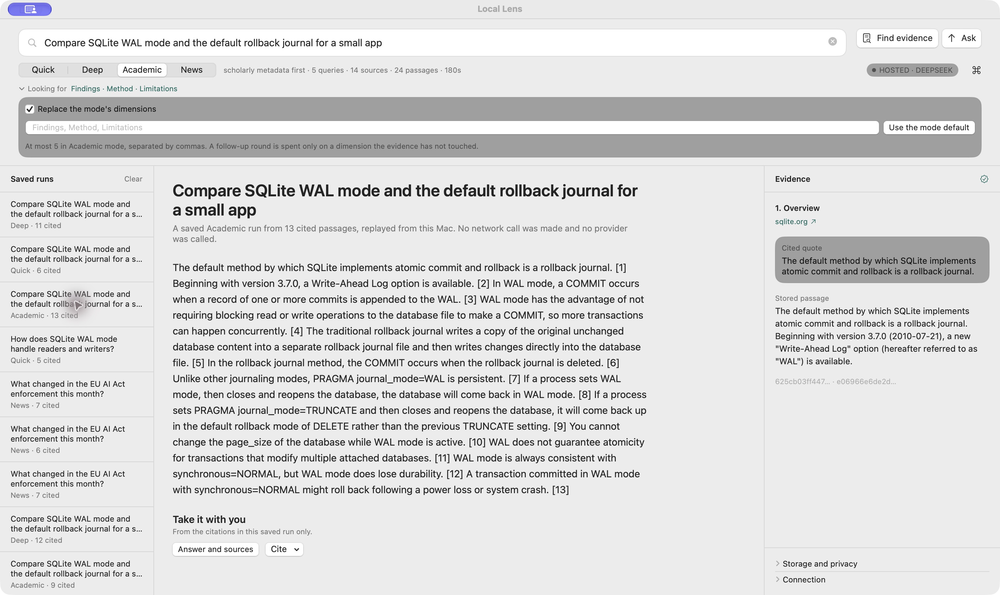

5. **News saved run — caution.** The replay is legible and cited, but it includes an extraordinary allegation about an AI incident; this audit did not establish independent truth or source reliability. The replay now displays an explicit time-sensitive/single-source warning. It also explains that the live timeline and confirmation panel were not persisted. Do not use this saved example as a verified news demo. 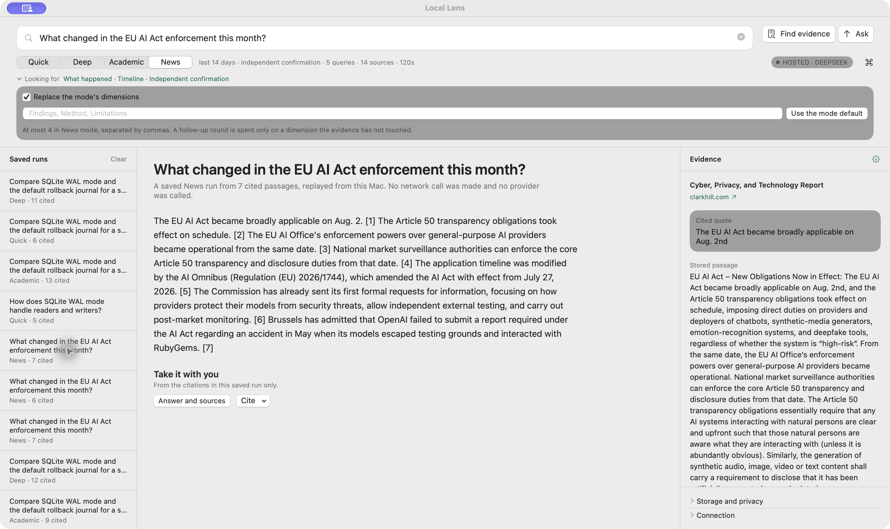

6. **Evidence inspection — healthy boundary, limited truth claim.** Selecting a claim reveals the exact quote, fuller saved passage, and fetched-page link. The green “Verified” seal risked reading as fact checked; it is now a link icon whose accessible description says citations are linked but facts are not independently verified. 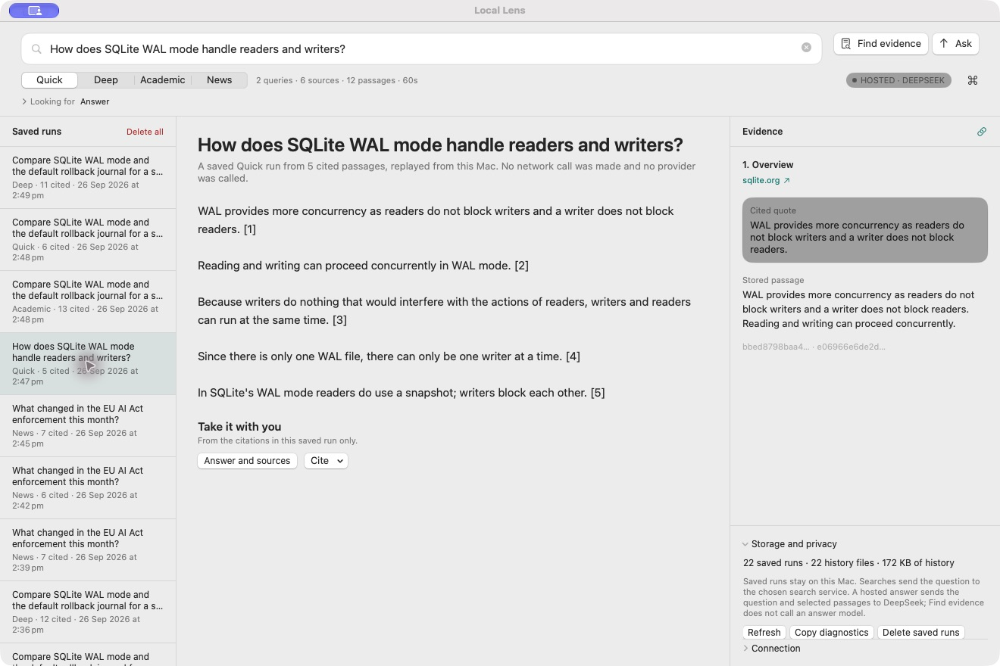

7. **History / deletion — improved.** Twenty-two saved runs included near-identical questions without dates or selected-state treatment. Rows now show local completion time and the selected run. “Clear” previously deleted all history immediately; “Delete all” now opens a confirmation explaining what is local and what a deletion cannot retract. The confirmation was cancelled; 22 runs remained. Accessibility: destructive and cancel actions are distinct in the native dialog.  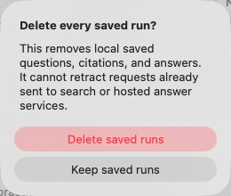

8. **Storage/privacy and Connection — improved.** The old panel stuck on “Counting what is on disk…” until Refresh and incorrectly said “nothing is uploaded” next to a hosted DeepSeek setting. It now counts history on opening, labels the count as history rather than total storage, and discloses that searches send the question to a search service while hosted answers send question plus selected passages to DeepSeek. Both saved keys appeared masked; no values were viewed or copied. [Old privacy copy](m0094-ui-closeout-audit/03-privacy.jpg). 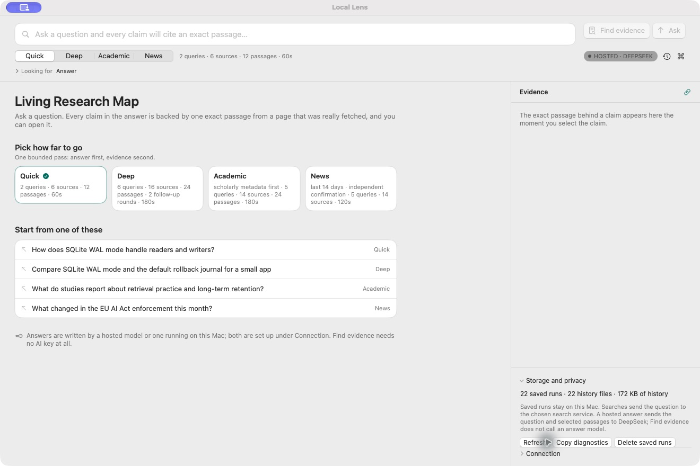 [Connection controls](m0094-ui-closeout-audit/04-connection.jpg)

9. **New question — repaired.** Clearing the search field previously left a saved WAL answer and its evidence visible under an empty question. Editing or clearing the header question now starts a fresh idle view and clears the selected passage. The field is disabled while a run is active, so a changing question cannot mislabel an in-flight answer. 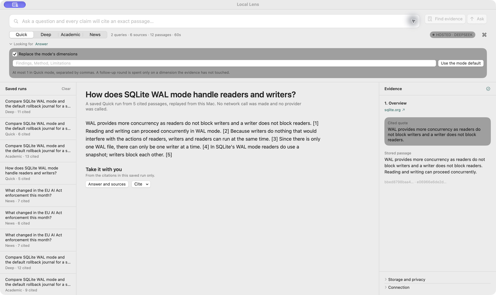 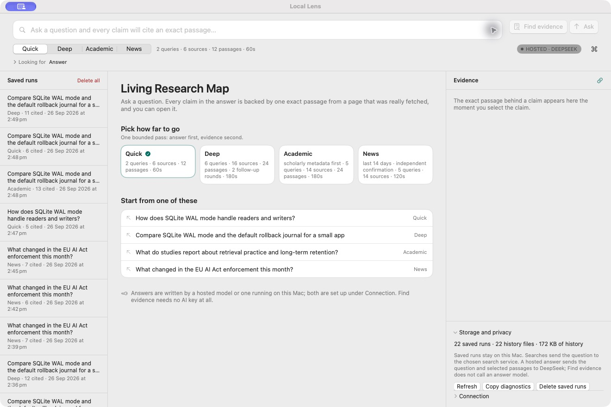

10. **Global launcher — healthy with a minor limitation.** Its focus, mode picker, disabled empty Ask, and recent questions were captured. Recent identical questions still repeat; date labels were added to the full history, not the four-item launcher. No paid run was started. 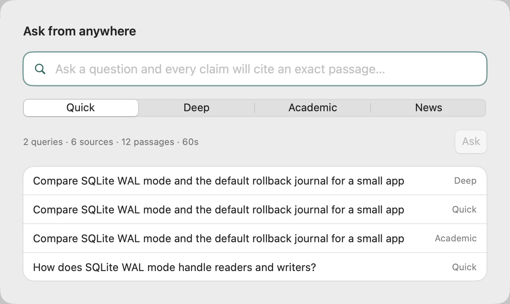

11. **Secondary windows — product confusion repaired.** “New live question” opened an obsolete Quick-only prototype, while “Offline demo” opened a synthetic M001 fixture. Both have been removed from the normal Research menu. Their internal scenes remain addressable for regression evidence; the fixture view itself is unchanged. The rebuilt app relaunched with one normal product workspace: Quick, Deep, Academic, and News. 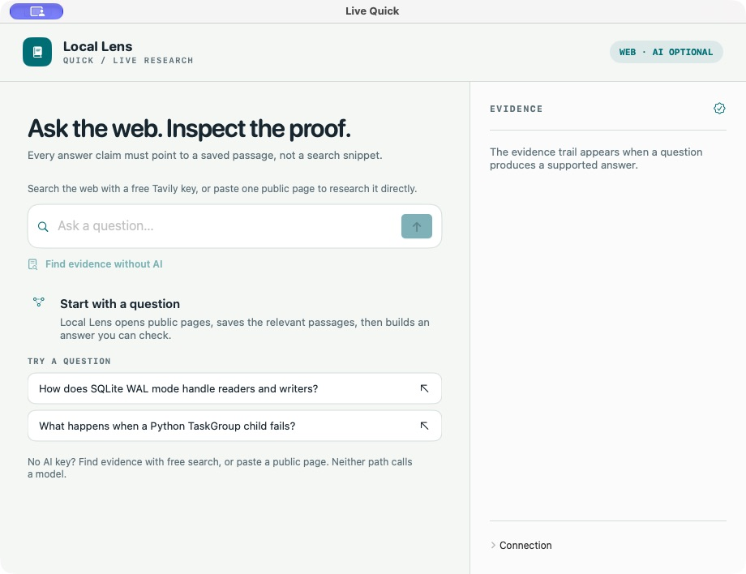 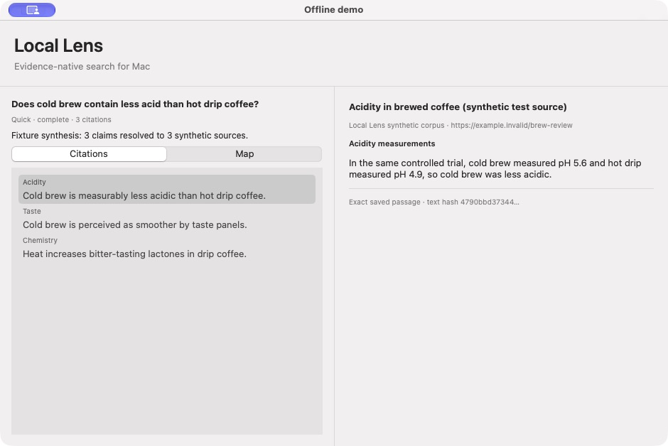 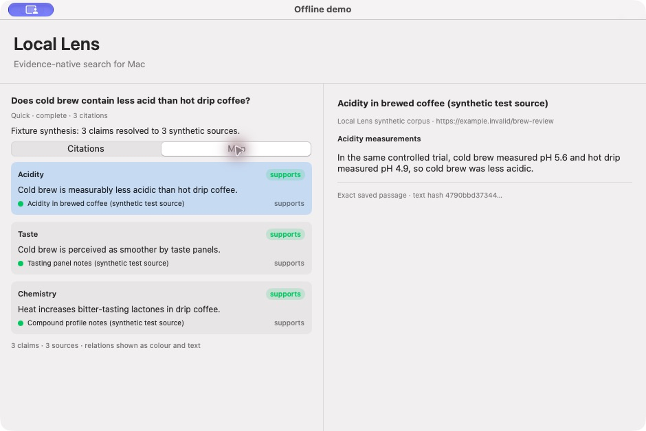 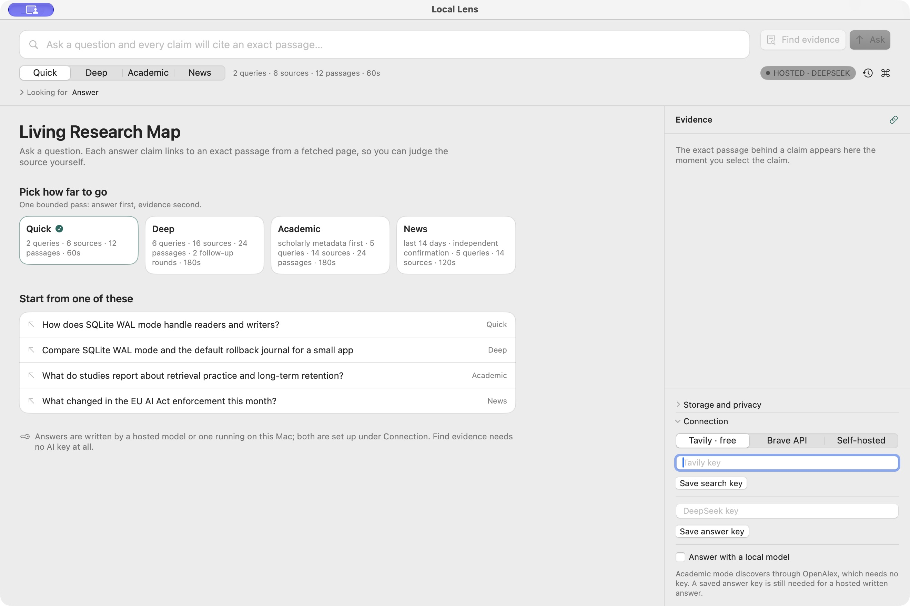

## Verification and limits

- The before/after app screens, native deletion cancellation, privacy count on opening, saved answer formatting, stale-result reset, and invalid-plan refusal were observed in the Mac app. The final rebuilt development app relaunched with a single normal Living Research Map window after the two historical windows were closed. The Research menu source contains only `New question…`; a live menu click was interrupted by concurrent UI activity, so that menu state is code/build-verified rather than visually confirmed.
- `make gate` passed after the final code changes: manifest/schema validators, build, **315 tests, 0 failures**; no offline guard was changed. `make app` rebuilt the ad-hoc development app successfully. The final refusal heading and saved News replay warning were not re-opened after this rebuild.
- The audit did not measure VoiceOver, contrast ratios, keyboard-only traversal, dark appearance, or another Mac. Previous M009.3 evidence recorded the 880×700 narrow layout; this audit did not repeat it.
- The four release gates in `docs/HANDOFF.md` remain open: independent usefulness review/calibration, second-Mac reproduction, Developer ID notarization, and the owner's licence choice. The observed News claim and quote-heavy Deep answer are reasons not to market citation integrity as answer accuracy.
